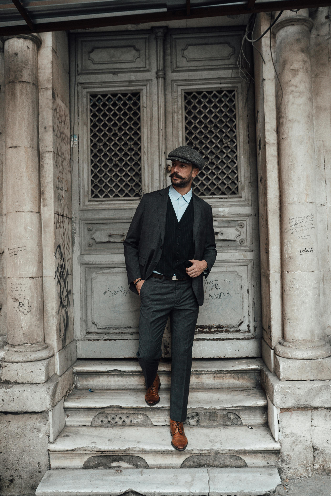
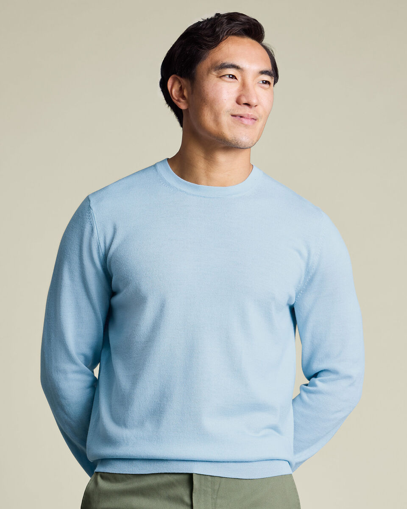
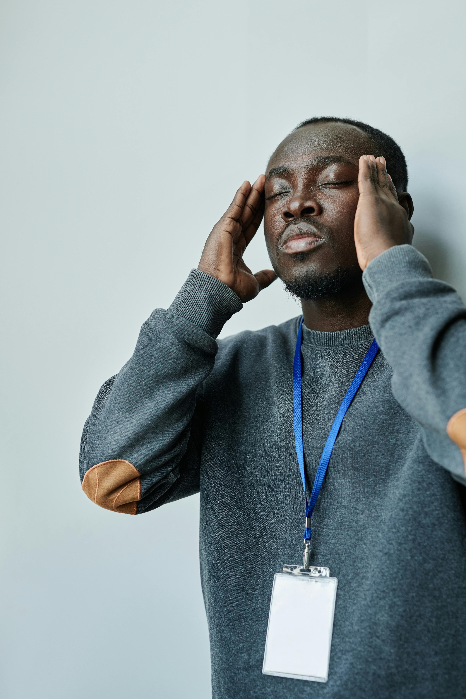
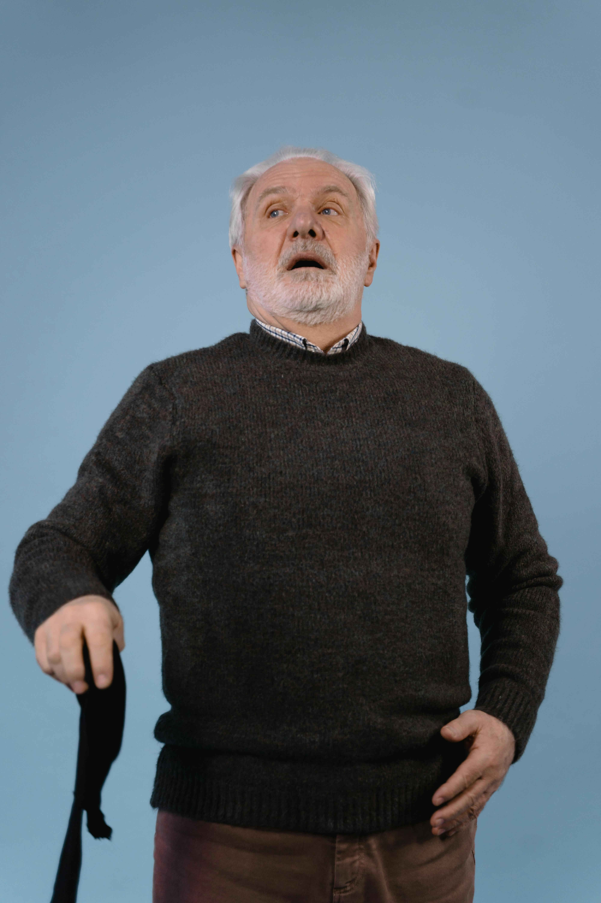
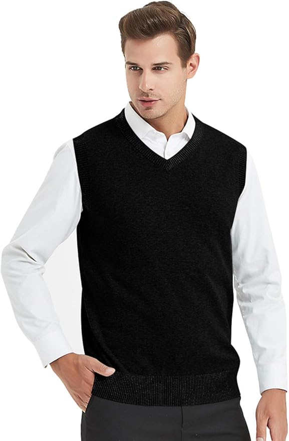
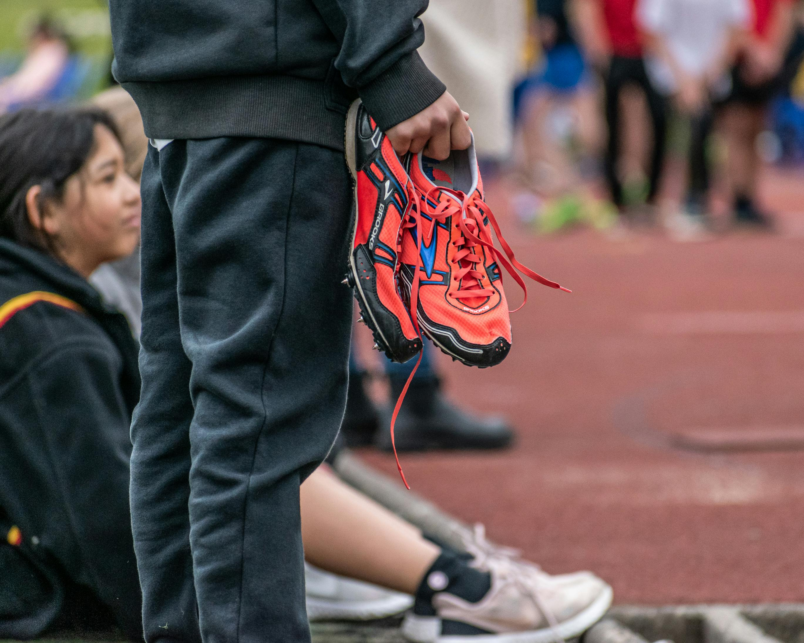
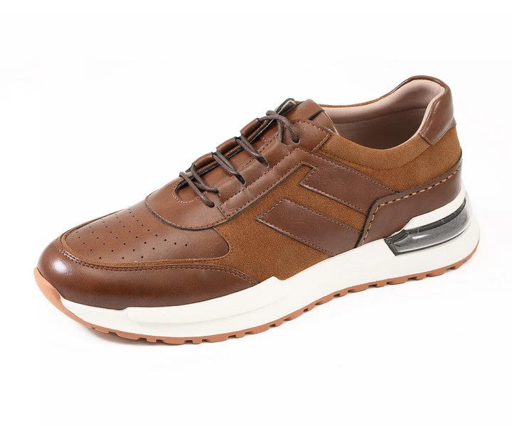
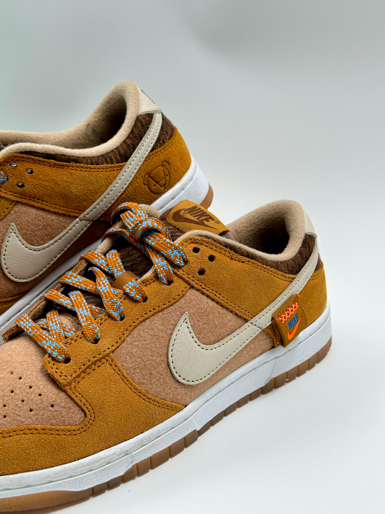
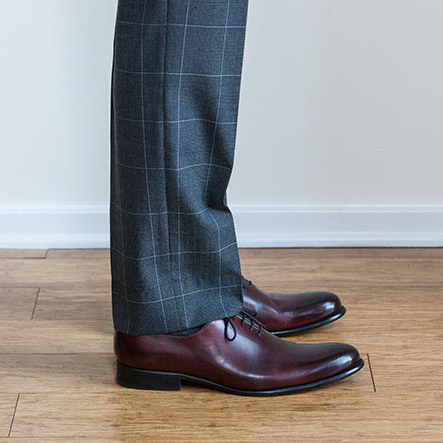
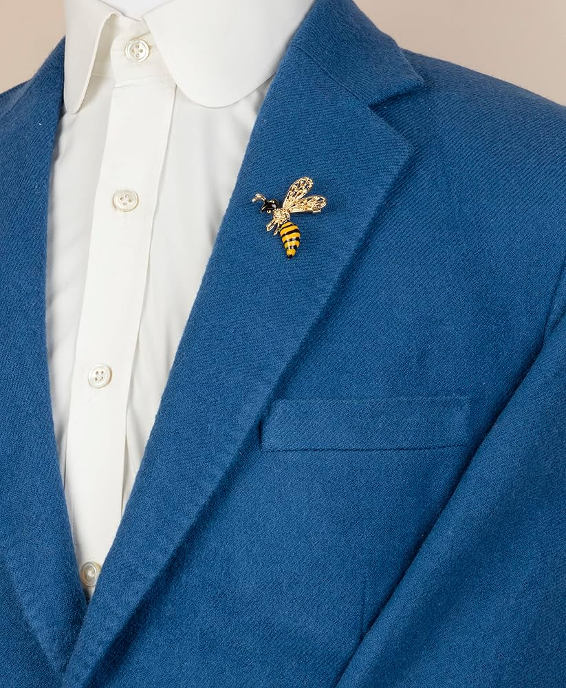

# Visual Examples — AMS-1 Reference Implementation

These images serve as **reference implementations**, not fashion inspiration.  
They illustrate compliant baseline appearances for each **Operational Context** and core garment type.

The goal is clarity and interoperability, not flair.

---

## Operational Contexts

### Athletic 

Athletic clothing is functional and performance-oriented.

---

### Casual

  

**Casual** is the default public mode for adult men.

Key elements:
- Structured jacket
- Leather shoes or minimalist sneakers
- Simple shirt
- Dark jeans or casual slacks

---

### Elevate

  
  

**Elevate** signals visible social effort.

Key elements:
- Jacket
- Leather dress shoes
- Button-up or refined knit
- Slacks or dark jeans
- Optional subtle color accents

---

### Authority

  

**Authority** contexts signal responsibility and competence.

Key elements:
- Structured jacket or suit
- Leather shoes
- Button-up shirt
- Slacks or suit trousers

---

## Jackets (Structured)

  

These are examples of structured jackets (sport coats or blazers), not casual outerwear.

---

## Sweaters

  
  

Sweaters provide warmth while maintaining adult structure in **Casual**, **Elevate**, and **Authority** contexts.

---

### Sweater Vest

A sweater vest provides warmth without bulk and integrates cleanly under jackets.

---

## Shoes

### Athletic

Reserved for **Athletic** contexts.

---

### Leather Shoes

  

Used in **Casual**, **Elevate**, and **Authority** contexts depending on formality.

---

### Dress boots

Casual leather boots integrate well with **Casual** and some **Elevate** contexts.

---

### Minimal / Dress Sneakers

  
  

Minimal sneakers may be used in **Casual** settings when clean and low-profile.

---

## Pants

Dark jeans are foundational to the **Casual** wardrobe.

---

### Pant Length Guidance

Trousers should rest lightly on the shoe with a slight break. The classic style is to reach the shoe and cover the sock. 

---

## Color Accents

Subtle color accents are optional and welcome in all contexts, especially those with jackets.